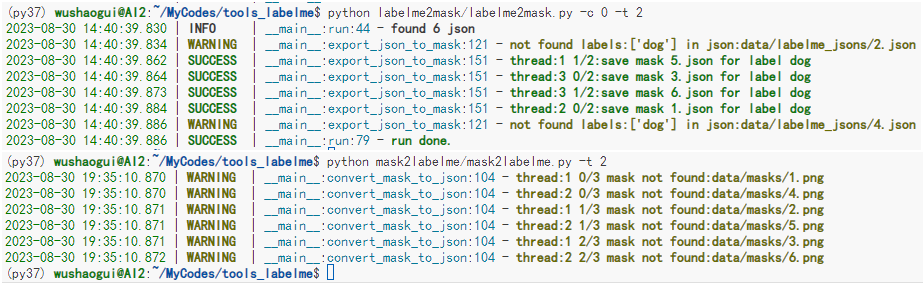

本项目包含2个功能：
1. 用于将labellme标注的json文件转为mask
2. 将mask转为可被labelme加载的json文件

## json->mask

- JSON_DIR          待解析的json位置
- MASK_DIR          保存mask的位置
- LABELS_NAME       待解析的标签名
- CONVERT_MODE      转换模式，当两个语义分割标注交叠在一起时，重叠部分属于一个类别，还是同时属于两个类别
- THREAD_NUM        多线程数量
- ISSAVE_EMPTY_MASK 没有标注的图片是否产生空mask

## mask->json

- IMAGE_DIR          图片路径
- MASK_DIR           mask路径
- JSON_DIR           保存的json路径
- TEMPLATE_JSON_PATH 待保存的json模板
- LABEL_NAME         mask的保存标签
- POINT_PRECISION    mask转为标注点的精度
- REPLACE_MASK       如果json路径存在json文件，是否将mask解析结果追加到json文件上
- THREAD_NUM         线程数量

## 项目亮度

1. **解析粘连mask**：修改labelme的官方代码`shapes_to_label`函数实现
2. **指定标签解析**：解析json中指定标签的mask,或者将mask生成为特定标签的json标注
3. **多线程处理**：两个过程支持多线程处理